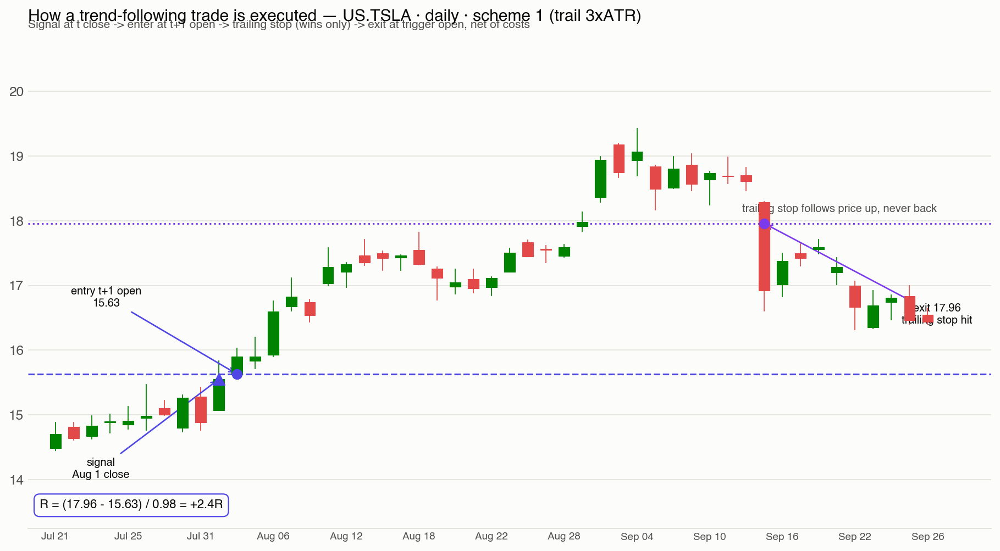
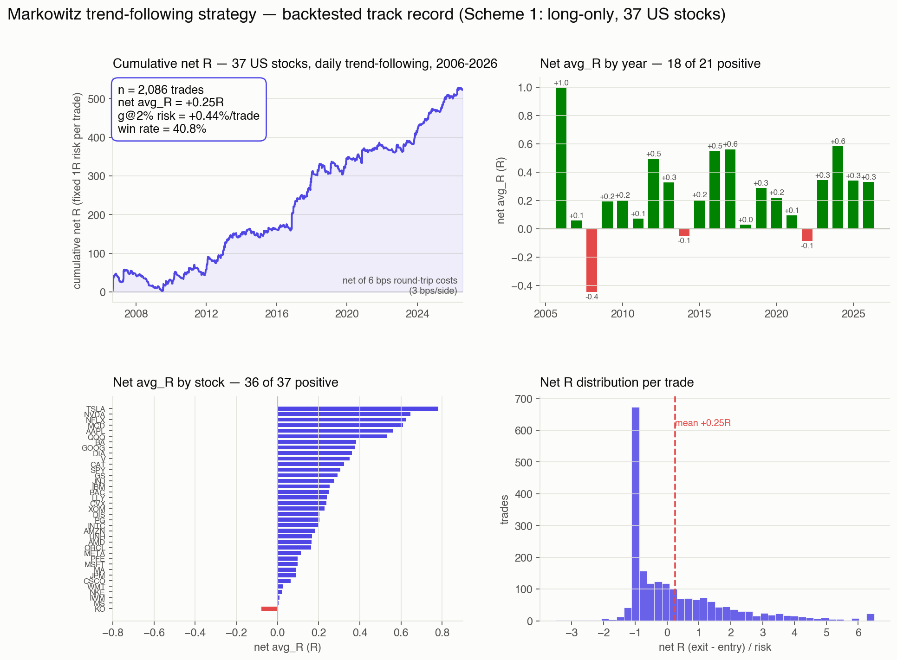

<p align="center">
  
</p>

<h1 align="center">Markowitz —— 港股 / 美股量化策略 Agent</h1>

<p align="center">
  <a href="LICENSE.md"></a>
  
  
  
  
</p>

<p align="center">🌐 <a href="README.md">English</a></p>

**Markowitz** 是一个专职**量化策略开发**的 AI agent，面向港股 / 美股，基于 [Claude Code](https://claude.com/claude-code) 构建。它把交易思路写成可回测的确定性代码，用历史数据回测标定策略的可信度，再把结果交给日内交易 agent **Victor**（[DayTradingAgent](https://github.com/xhqing/DayTradingAgent)），作为 Victor 众多输入中一个「经过历史验证、可量化的加权投票员」。

> 这**不是**一个传统意义上的软件项目：没有可供 `npm install` 的应用。**这个仓库本身就是 agent**——它的全部行为方式都由 `.claude/` 下的 skills（外加用户的全局 rules）塑造，Claude Code 加载它们，作为 Markowitz 的工作纪律。

---

## Markowitz 是谁？

这个 agent 有一个拟人化的名字——**Markowitz**（马科维茨），一位量化策略开发者。名字致敬**哈里·马科维茨**——现代投资组合理论之父、诺贝尔经济学奖得主，他提出的均值-方差模型奠定了量化投资的根基。

Markowitz **不盯盘、不下单、不发实时交易信号**——那是 Victor 的职责。Markowitz 的工作是**离线**的、**确定性**的：把交易思路写成纯函数代码，用多年的历史 K 线回测，让回测结果——而不是直觉——来为每个策略标定可信度。

它的优势来自可复现的数学严谨：

- **输出全量化**：每个字段要么是数值、要么是有限枚举——没有定性文字（如「动能减弱」）。这是量化区别于主观交易的本质。
- **可信度由回测赋予**：策略不自评分数，它的 confidence 来自其信号类别在历史上的胜率 / avg_R。
- **纯函数、无未来函数**：同样的 K 线 + 同样的参数 → 永远同样的输出，决策绝不偷看未来数据。

---

## 与 Victor（DayTradingAgent）的关系

Markowitz 和 Victor 是**两个独立、互补的项目**：

| | Markowitz（本项目） | Victor（[DayTradingAgent](https://github.com/xhqing/DayTradingAgent)） |
|---|---|---|
| **职责** | 设计并回测量化策略 | 盯盘并发出交易信号 |
| **模式** | 离线、确定性代码 | 实时、LLM 判断 |
| **产物** | 策略代码 + 可信度查表 | 🟢/🔴/🟡/🟠 信号（人工执行） |
| **碰账户吗** | 不——绝不 | 不——仅信号模式 |

Markowitz 的产物是 Victor 的**其中一个加权输入**——一个「经过历史验证的可量化投票员」。它不取代 Victor 的判断；主观因子（资金流、盘口、新闻、宏观）仍留在 Victor 那里。

> 为什么要拆开？LLM 本人不可回测（拟人存在、无法 100% 复现、和人一样有前视偏差）。但确定性的策略代码**可以**回测。所以 Markowitz 把交易逻辑中「可回测的子集」形式化出来，交给回测去打分。

---

## 核心理念

| 原则 | 含义 |
|---|---|
| **事实先验证** | 实体归属、算术、日历、API 字段、手续费——先验证再断言，禁止把推测当事实。 |
| **全量化输出** | 每个输出字段是数值或有限枚举；判定依据放进数值化的 `features`，绝不写定性文字。 |
| **回测标定可信度** | 策略只负责分类（输出一个 `category`）；胜率 / avg_R / 样本数来自回测，不是自评。 |
| **纯函数可复现** | 同样的缓存数据 + 同样的参数 + 同样的代码 = 完全相同的回测。无随机、无全局状态、无未来函数。 |
| **avg_R 优化** | 优化平均风险倍数盈亏（期望值），不是胜率、不是总收益率。 |

---

## Markowitz 如何工作


1. **设计**——在 `strategies/` 写一个纯函数策略 `evaluate(bars, params) -> dict | None`，返回战略层 / 战术层 schema，**不含** confidence。
2. **回测**——`backtest.py` 逐根遍历 K 线（严防未来函数），记录每笔交易的 R 倍数，按 `category` 分组。
3. **标定**——按类别聚合出 `confidence_table.json`（`win_rate` / `avg_R` / `samples`）；样本太少的类别打折。
4. **交付**——策略 + 可信度查表，成为 Victor 的一个加权输入。

一笔真实回测交易的执行机制（`US.TSLA` 日 K 趋势跟随，2014 年）：



- 信号在 `t` 根**收盘后**产生 → 在 **`t+1` 开盘价**成交（保守假设——绝不用信号根自己的价格）。
- 出场纯机械：日内用固定止损 / 止盈 / 超时，日 K 趋势跟随用移动止损（只进不退）——谁先触发谁生效，按触发根开盘价成交。
- `R = (出场价 − 进场价) / 风险`，其中 `风险 = stop_atr × ATR`——每笔交易的盈亏都换算成风险倍数，跨策略可直接比较。
- 成本（滑点 + 佣金 + 印花税）在**报出任何业绩数字之前**逐笔扣除。

---

## 回测业绩

第一个交付的策略——**日 K 趋势跟随**（只做多，37 只美股大盘股与 ETF，移动止损 3×ATR）——在约 20 年日 K（2006–2026，共 2086 笔）上回测：



| 指标 | 数值 |
|---|---|
| 区间 / 笔数 | 2006–2026 · 2086 笔 |
| 净 avg_R（扣 6bps 双边成本后） | 每笔 **+0.25 R** |
| 每笔风险 2% 的对数增长率 `g` | **每笔 +0.44%** |
| 胜率 | 40.8%（低胜率、高盈亏比——设计如此） |
| `g` 为正的标的 | 34 / 37 |
| 正收益年份 | 18 / 21（负的三年：2008、2014、2022——危机 / 震荡市） |

业绩数字之外的多重验证（横截面、按年、参数稳健性、严格 walk-forward 零衰减）见 [`swing/STRATEGY.md`](swing/STRATEGY.md)。诚实说明：**日内（分钟 K）策略已被系统性证伪**——动量与均值回归在扣港股印花税后均无可用 edge（这是已记录的结论，不是缺口）；edge 存在于日 K 尺度。回测业绩不代表未来收益——见下方[风险声明](#风险声明)。

---

## 数据源

| 数据源 | 深度 | 角色 |
|---|---|---|
| **富途 OpenD**（`futu-api`） | 约 5.5 年分钟 K（1m/5m/15m，2021-01-21 起）；约 20 年日 K | **分钟级日内回测主力** |
| **长桥 CLI** | 十几年日 K（分页，每页 1000 根） | 日 K 回测 + 交叉验证 |
| 资金流 / 盘口 / 换手率 | 仅当日，**无历史** | 不进策略（留在 Victor 主观判断） |

完整调研（含付费第三方渠道）见 `.claude/skills/quant/data-sources.md`。

---

## 仓库结构

```
QuantStrategistAgent/
├── CLAUDE.md                      # 项目入口——Markowitz 的角色、铁律、工作流
├── LICENSE.md                     # MIT
├── README.md                      # 英文 README
├── README_cn.md                   # 本文件（中文）
│
├── .claude/
│   ├── settings.local.json        # 本机配置：permissions + autoMemoryDirectory（已 gitignore）
│   ├── settings.local.example.json # settings.local.json 模板（入库）
│   ├── memory/                    # AutoMemory 存储（项目级，入库——不 gitignore）
│   │
│   └── skills/
│       ├── quant/                 # 量化策略开发规范——Markowitz 的核心
│       │   ├── SKILL.md           # 主文件：执行规范 + 铁律
│       │   ├── README.md          # 目录用途 + 设计原则 + 约定
│       │   ├── schema.md          # 策略输入输出契约 + 回测设计
│       │   ├── data-sources.md    # 日内分时数据源调研
│       │   ├── strategies/        # 每个策略一个纯函数文件
│       │   ├── data.py            # K 线拉取（富途分钟 + 长桥日 K）
│       │   ├── backtest.py        # 回测驱动器 → 类别可信度查表
│       │   └── data_cache/        # parquet 快照（已 gitignore——可重生）
│       ├── anysearch/             # 通用搜索 skill（随 agent 公开）
│       └── find-skill/            # 通用 skill 发现 skill（随 agent 公开）
```

---

## 前置条件

要让 Markowitz 真正跑起来，仓库之外还需要：

- [Claude Code](https://claude.com/claude-code)
- **富途 OpenD** 本地网关在运行（分钟 K 回测主力源）
- **长桥 CLI** 已配置（日 K 回测 + 交叉验证）
- Python 3 及 `pandas`（按需装 `futu-api` / 长桥绑定）
- 可选：把 `.claude/settings.local.example.json` 复制为 `.claude/settings.local.json`，把 `autoMemoryDirectory` 改成你本机的绝对路径，让 AutoMemory 存到项目内

即便没有这些环境，本仓库仍是一份完整的「一个守纪律的量化策略 agent 应当如何工作」的规范说明。

---

## 当前阶段

Markowitz 已越过 MVP。schema、回测引擎与数据层全部就位，**第一个验证过的策略已交付**——37 只美股日 K 趋势跟随（见上方[回测业绩](#回测业绩)）。它以独立工具集的形式放在 [`swing/`](swing/README.md)，含三个 CLI：`check_signal.py`（每日信号扫描）、`backtest.py`（方案 / 自定义回测）、`analyze.py`（业绩分析）。

已尝试并放下的方向，如实说明：

- **日内（分钟 K）策略已被系统性证伪**——扣港股印花税后无预测 edge；结论已记入 `.claude/skills/quant/SKILL.md`，防止重走死胡同。
- **日 K 趋势跟随 edge 通过了严格验证**（34/37 标的正、18/21 年正、参数稳健高原、walk-forward 零衰减——详见 `swing/STRATEGY.md`）。
- 下一步：扩充标的池（低相关品种）、跟踪实盘信号检查、随新历史积累持续复验。

---

## 风险声明

量化策略是研究工具，不是收益保证。回测表现不代表未来收益——过拟合、市场状态切换、前视偏差都可能虚高历史指标。Markowitz 产出的是策略代码与可信度估计，供用户研究决策参考；**它不构成投资建议，也不执行任何交易。** 作者与贡献者不对任何交易损失承担责任。

---

## 引用与署名

本项目以 MIT 许可证开源，额外请求使用者在**使用、二次分发或基于本项目构建衍生作品**时，注明作者并引用项目地址：

- **作者：** All Contributors
- **项目：** Markowitz —— 港股 / 美股量化策略 Agent
- **地址：** https://github.com/xhqing/QuantStrategistAgent

若你 Fork、引用代码或基于本仓库二次开发，请在文档 / README / 致谢中保留以上出处（作者、项目名、仓库地址）。

---

## 许可证

[MIT](LICENSE.md) © 2026 All Contributors。
